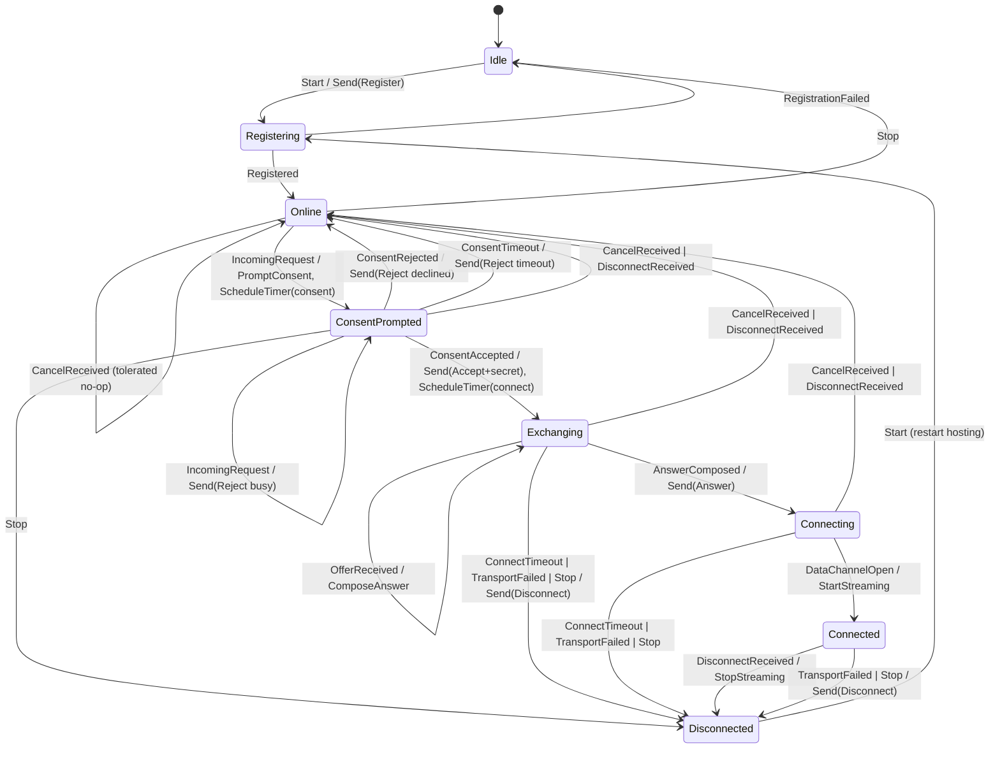
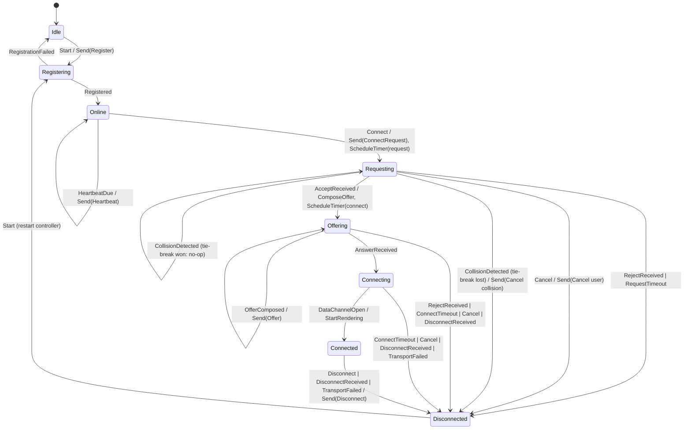

# Session state machines (M0 contract)

Both machines live in `crates/session`. They are pure decision functions:
the caller injects an event and a logical `now_ms`; the machine returns the
next state implicitly and a list of `Action`s (envelopes to send, timers to
schedule/cancel, local pipeline commands) to execute. No clocks, no network,
no threads. `crates/session/tests/two_peers.rs` is the executable reference
model for the M2 node runtime.

Shared semantics:

- **Deduplication.** Every event carrying a `message_id` first passes a
  bounded LRU (capacity `SessionConfig::dedupe_capacity`, default 256). A
  duplicate is `Ok(no actions)` with no state change — idempotent delivery
  per the signaling contract.
- **Illegal transitions.** Any event not legal in the current state returns
  `Err(IllegalTransition { state, event })` and never mutates state. The
  exhaustive legal tables are pinned by the unit tests in
  `crates/session/src/host.rs` and `controller.rs`.
- **Post-mortem tolerance.** In `Disconnected`, *late remote session traffic*
  (offer/accept/reject/answer/ICE/disconnect/cancel) is dropped as a no-op —
  it raced our own timeout/teardown. Local/runtime events (user actions,
  `DataChannelOpen`, `OfferComposed`, ...) remain illegal there. New incoming
  requests are not tolerated: the runtime must not deliver mailbox traffic
  while the role is not registered.
- **Timers.** Machines emit `ScheduleTimer`/`CancelTimer`; the runtime owns
  the clock and raises the matching `*Timeout` event. `HeartbeatDue` is
  raised by the runtime cadence while the role is registered
  (`Online`/`ConsentPrompted`/`Exchanging`/`Connecting`/`Connected`).
- **Reconnect.** No automatic reconnect in MVP
  (`ReconnectPolicy::max_attempts == 0` placeholder; M5 wires the real
  policy). Re-enabling a role is an explicit `Start`.

## Host state machine

`HostSession` (`crates/session/src/host.rs`)

Notes:

- `IncomingRequest` while prompted/exchanging/connecting/connected answers
  `Reject{busy}` — one session per host (MVP).
- The one-time session secret is generated by the host UI, carried in
  `ConsentAccepted`, sent exactly once inside `Accept`, and never logged.

## Controller state machine

`ControllerSession` (`crates/session/src/controller.rs`)

## Simultaneous-call collision (node-level rule)

Both roles of one device are separate machines, so the collision rule spans
them and is implemented by the **node runtime** (the M0 test harness `World`
is the reference):

1. When a `connect_request` from peer **X** is delivered to our host and our
   controller is `Requesting` toward **X**, the runtime raises
   `CollisionDetected{peer: X}` on the controller.
2. When the user issues `Connect` to peer **X** and our host already shows a
   consent prompt for **X**, the runtime raises the same event.
3. Tie-break: **the lexicographically smaller device id keeps the controller
   role.** The losing controller sends `Cancel{reason: "collision"}` and goes
   `Disconnected{Collision}`; the winner does nothing. The loser's cancel
   clears the winner's host prompt. Both nodes apply the same rule locally,
   so the outcome is deterministic without extra communication.

The host's `CancelReceived` is tolerated in `Online` (no-op) because the
loser's cancel can race the delivery of its own request through the mailbox.

## Disconnect causes (`DisconnectCause`)

`User`, `Peer`, `Timeout`, `Rejected(reason)`, `Canceled`, `Collision`,
`TransportError` — mapped to user-visible copy in M4; never remapped silently.
