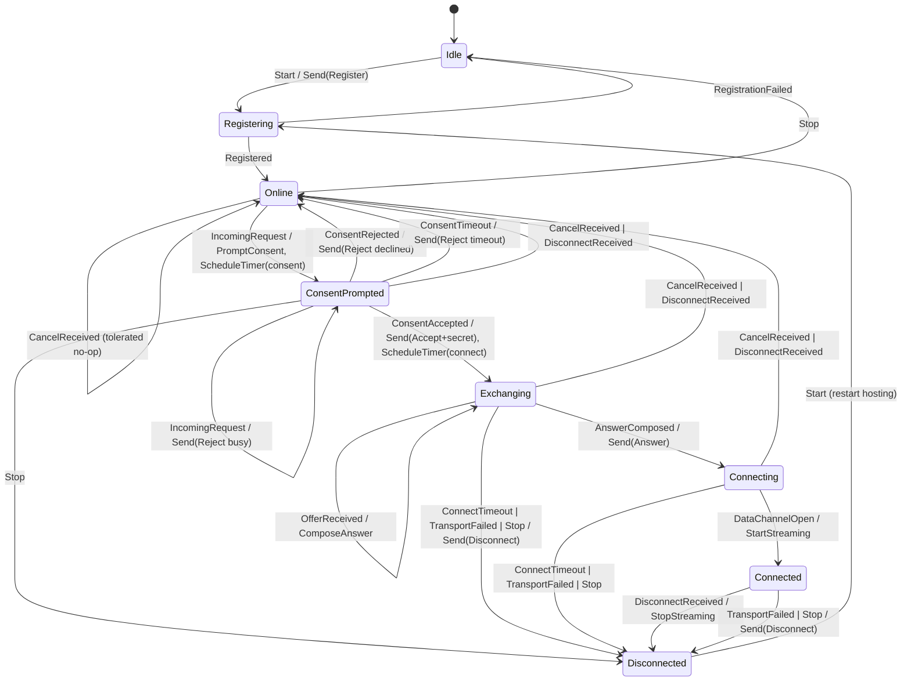
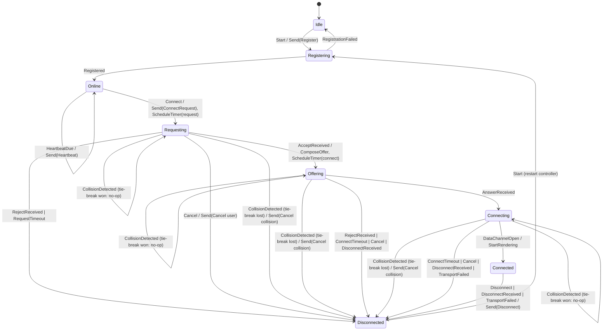

# Session state machines (M0 contract)

Both machines live in `crates/session`. They are pure decision functions:
the caller injects an event and a logical `now_ms`; the machine returns the
next state implicitly and a list of `Action`s (envelopes to send, timers to
schedule/cancel, local pipeline commands) to execute. No clocks, no network,
no threads. `crates/session/tests/two_peers.rs` is the executable reference
model for the M2 node runtime.

Shared semantics:

- **Deduplication.** Every event carrying a `message_id` first passes a
  bounded LRU (capacity `SessionConfig::dedupe_capacity`, default 256). A
  duplicate is `Ok(no actions)` with no state change — idempotent delivery
  per the signaling contract.
- **Illegal transitions.** Any event not legal in the current state returns
  `Err(IllegalTransition { state, event })` and never mutates state. The
  exhaustive legal tables are pinned by the unit tests in
  `crates/session/src/host.rs` and `controller.rs`.
- **Post-mortem tolerance.** In `Disconnected`, *late remote session traffic*
  (offer/accept/reject/answer/ICE/disconnect/cancel) is dropped as a no-op —
  it raced our own timeout/teardown. Local/runtime events (user actions,
  `DataChannelOpen`, `OfferComposed`, ...) remain illegal there. New incoming
  requests are not tolerated: the runtime must not deliver mailbox traffic
  while the role is not registered.
- **Timers.** Machines emit `ScheduleTimer`/`CancelTimer`; the runtime owns
  the clock and raises the matching `*Timeout` event. `HeartbeatDue` is
  raised by the runtime cadence while the role is registered
  (`Online`/`ConsentPrompted`/`Exchanging`/`Connecting`/`Connected`).
- **Reconnect.** No automatic reconnect in MVP
  (`ReconnectPolicy::max_attempts == 0` placeholder; M5 wires the real
  policy). Re-enabling a role is an explicit `Start`.
- **Message ids (QA F1).** Every envelope the machines mint gets a
  role-namespaced, deterministic id: `"{device}-host-{n}"` from the host
  machine, `"{device}-ctrl-{n}"` from the controller machine (session ids
  share the controller's counter space). One process runs both roles, and the
  signaling service dedupes on `message_id` process-wide — the role tag is
  what keeps the two machines' envelopes distinct.

## Host state machine

`HostSession` (`crates/session/src/host.rs`)

Notes:

- `IncomingRequest` while prompted/exchanging/connecting/connected answers
  `Reject{busy}` — one session per host (MVP).
- The one-time session secret is generated by the host UI, carried in
  `ConsentAccepted`, sent exactly once inside `Accept`, and never logged.

## Controller state machine

`ControllerSession` (`crates/session/src/controller.rs`)

## Simultaneous-call collision (node-level rule)

Both roles of one device are separate machines, so the collision rule spans
them and is implemented by the **node runtime** (the M0 test harness `World`
is the reference). Per QA F2, the rule covers the *whole* outbound window —
a peer's request can arrive while our controller is `Requesting`,
`Offering`, or `Connecting` (mailbox latency, stale TTL redelivery, or an
accept that raced the cross-delivery):

1. When a `connect_request` from peer **X** is delivered to our host and our
   controller has an outbound session toward **X** (`Requesting` /
   `Offering` / `Connecting`), the runtime raises
   `CollisionDetected{peer: X}` on the controller.
2. Symmetrically, when the user issues `Connect` to peer **X** while our host
   already holds an inbound session from **X** (consent prompt, exchanging,
   or connecting), the runtime raises the same event.
3. Tie-break: **the lexicographically smaller device id keeps the controller
   role.** The losing controller cancels its outbound attempt —
   `Cancel{reason: "collision"}`, canceling its active timer
   (`ControllerRequest` in `Requesting`, `ControllerConnect` otherwise) —
   and goes `Disconnected{Collision}`, abandoning its own controller side in
   favor of its host side. The winner does nothing. The loser's cancel
   clears the winner's host prompt. Both nodes apply the same rule locally,
   so the outcome is deterministic without extra communication, and exactly
   one session survives in every realizable interleaving.

The host's `CancelReceived` is tolerated in `Online` (no-op) because the
loser's cancel can race the delivery of its own request through the mailbox.

## ICE-candidate routing (role-complementary; M2 QA F34)

The offer/answer split gives each machine ownership of its own role's
transport: the controller machine composes the offer and owns the
controller-side peer connection, the host machine composes the answer and
owns the host-side one. A candidate gathered by the peer's **host-role
transport must therefore be delivered to this node's *controller* machine**
(its `ForwardIce` action feeds the controller transport), and a candidate
gathered by the peer's controller-role transport reaches the *host* machine
— role-complementary routing, not role-preserving.

The runtime that mints a candidate envelope tags it with the
**transport-owning role** (the node knows which role owns the attached
transport; this is not derivable from session states, since e.g. the host
process gathers candidates while its own host machine is `Connecting` and
its controller machine is idle). The M0 harness `World::route` implements
the same complementary mapping (`crates/session/tests/two_peers.rs`; the
arm was dead code in the original scripted scenarios and encoded the
opposite routing until QA F34 fixed it — `trickled_candidates_route_to_the_
transport_owner_both_directions` now pins both directions), and
`node-runtime`'s `ice_candidates_route_to_the_peer_transport_owner` mirrors
it against the real `Node`.

## Disconnect causes (`DisconnectCause`)

`User`, `Peer`, `Timeout`, `Rejected(reason)`, `Canceled`, `Collision`,
`TransportError` — mapped to user-visible copy in M4; never remapped silently.
